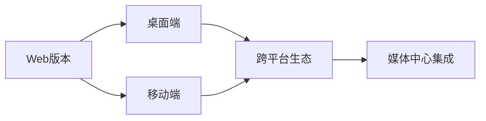

<div align="center">

# 🎬 IKuYo 动漫资源管理系统


*面向追番爱好者的智能动漫资源采集与管理工具*

[](https://www.python.org/downloads/)
[](https://vuejs.org/)
[](https://www.typescriptlang.org/)
[](https://github.com/astral-sh/uv)
[](LICENSE)

</div>

---

## 📖 项目简介

IKuYo 是一个现代化的**全栈动漫资源管理系统**，集成了智能爬虫、数据聚合、RESTful API和美观的Web界面。系统自动化采集 **Mikan Project** 站点的番剧资源信息，结合 **Bangumi API** 提供丰富的番剧元数据，为追番爱好者提供一站式的番剧浏览和资源管理体验。

### ✨ 核心特性

#### 🎯 **智能后端**
- 🚀 **多模式采集**：支持首页、按年、按季、全量、增量等多种采集策略
- ⏰ **定时调度**：内置 APScheduler 定时任务，自动化追番更新
- 🎯 **精准解析**：智能识别番剧信息、字幕组、资源链接等关键数据
- 💾 **本地存储**：SQLite 数据库持久化，支持数据导出和分析
- 🚀 **RESTful API**：FastAPI驱动的高性能查询接口，支持分页、搜索、过滤
- 📺 **Bangumi集成**：自动获取番剧评分、简介、标签等丰富元信息

#### 🎨 **现代前端**
- ⚡ **Vue 3界面**：基于 Composition API 构建的现代化响应式界面
- 📱 **响应式设计**：适配桌面、平板、移动端各种屏幕尺寸
- 🎪 **直观浏览**：每日放送展示、番剧详情页、智能排序和搜索
- 🏷️ **丰富信息**：评分分布、标签系统、集数状态可视化
- 🎭 **美观UI**：卡片式布局，现代化设计风格，暗色主题友好

#### 🔧 **技术先进**
- 🧩 **模块化架构**：爬虫、API、前端分离设计，便于维护和扩展
- 📦 **一体化部署**：单仓库管理，简化开发和部署流程
- 🚀 **性能优化**：前后端缓存、API响应优化、图片懒加载
- 🔮 **跨平台就绪**：为后续桌面端(Tauri)和移动端(Capacitor)APP奠定基础

---

## 🚀 快速开始

### 📋 环境要求

#### 后端
- 🐍 **Python 3.12** 及以上版本
- 📦 **uv** 包管理器（推荐）

#### 前端
- 📦 **Node.js 18** 及以上版本
- 🧶 **npm** 或其他包管理器

### 📥 一键启动

```bash
# 1. 克隆项目
git clone https://github.com/Niloux/IKuYo.git
cd IKuYo

# 2. 安装后端依赖
uv sync

# 3. 安装前端依赖
cd frontend
npm install
cd ..

# 4. 启动后端API (新终端)
uv run python scripts/run_api.py --reload --debug

# 5. 启动前端开发服务器 (新终端)
cd frontend
npm run dev

# 6. 访问应用
# 前端: http://localhost:5173
# API文档: http://localhost:8000/docs
```

### 🎮 爬虫使用

| 模式 | 命令 | 说明 |
|------|------|------|
| 🏠 **首页模式** | `uv run python scripts/run_crawler.py` | 采集首页推荐番剧 |
| 📅 **按年模式** | `uv run python scripts/run_crawler.py --mode year --year 2024` | 采集2024年所有番剧 |
| 🍃 **按季模式** | `uv run python scripts/run_crawler.py --mode season --year 2024 --season 春` | 采集2024年春季番剧 |
| 🌐 **全量模式** | `uv run python scripts/run_crawler.py --mode full` | 采集所有年份番剧 |
| 🔄 **增量模式** | `uv run python scripts/run_crawler.py --mode incremental` | 仅采集新增/更新番剧 |

---

## 🏗️ 技术架构

### 📊 整体架构图

```
┌─────────────────┐    ┌─────────────────┐    ┌─────────────────┐
│   前端界面       │    │    后端API     │    │   数据采集      │
│                │    │                │    │                │
│  Vue 3         │◄──►│  FastAPI       │◄──►│  Scrapy        │
│  TypeScript    │    │  SQLite        │    │  APScheduler   │
│  Responsive    │    │  Bangumi API   │    │  智能解析      │
└─────────────────┘    └─────────────────┘    └─────────────────┘
         │                       │                       │
         ▼                       ▼                       ▼
  用户友好界面           高性能API服务        自动化数据采集
```

### 🛠️ 技术栈详情

#### 后端 (Python)
- **核心框架**: FastAPI - 高性能异步API框架
- **数据存储**: SQLite - 轻量级关系数据库
- **爬虫引擎**: Scrapy - 专业网页爬虫框架
- **任务调度**: APScheduler - 定时任务管理
- **外部API**: Bangumi API - 番剧元数据集成
- **缓存机制**: 内置缓存 - 提升API响应性能

#### 前端 (TypeScript)
- **核心框架**: Vue 3 (Composition API) - 现代响应式框架
- **类型系统**: TypeScript - 静态类型检查
- **构建工具**: Vite - 极速开发构建
- **路由管理**: Vue Router 4 - 客户端路由
- **HTTP客户端**: Axios - API通信
- **UI设计**: 原生CSS + 响应式布局

#### 开发工具
- **包管理**: uv (Python) + npm (Node.js)
- **代码检查**: ESLint + Prettier
- **版本控制**: Git
- **API文档**: FastAPI自动生成 (Swagger UI)

### 📁 项目结构

```
IKuYo/
├── 📄 config.yaml              # 主配置文件
├── 📄 pyproject.toml           # Python依赖管理
├── 🖼️ assets/                  # 静态资源
├── 📁 ikuyo/                   # Python后端代码
│   ├── api/                   # FastAPI接口层
│   │   ├── main.py           # API应用入口
│   │   ├── routes/           # 路由模块
│   │   └── models/           # 数据模型
│   ├── core/                  # 核心业务逻辑
│   │   ├── bangumi_service.py # Bangumi API服务
│   │   ├── cache_service.py   # 缓存服务
│   │   ├── database.py        # 数据库抽象层
│   │   └── scheduler.py       # 任务调度器
│   ├── crawler/               # Scrapy爬虫模块
│   │   ├── spiders/           # 爬虫实现
│   │   ├── items.py           # 数据结构定义
│   │   └── pipelines.py       # 数据处理管道
│   └── utils/                 # 工具函数
├── 📁 frontend/                # Vue前端应用
│   ├── src/
│   │   ├── views/             # 页面组件
│   │   │   ├── HomeView.vue   # 首页 - 每日放送
│   │   │   └── AnimeDetailView.vue # 详情页
│   │   ├── components/        # 通用组件
│   │   │   ├── AnimeCard.vue  # 番剧卡片
│   │   │   ├── EpisodeDisplay.vue # 集数展示
│   │   │   └── EpisodeCarousel.vue # 集数轮播
│   │   ├── services/          # API服务层
│   │   │   └── api.ts         # API封装
│   │   └── router/            # 路由配置
│   ├── package.json           # 前端依赖
│   └── vite.config.ts         # 构建配置
├── 📁 scripts/                 # 管理脚本
│   ├── run_crawler.py         # 爬虫启动脚本
│   ├── run_api.py            # API启动脚本
│   └── manage_scheduler.py    # 调度管理脚本
├── 📁 data/                   # 数据存储
│   ├── database/              # SQLite数据库
│   ├── logs/                  # 运行日志
│   └── output/                # 导出数据
└── 📁 docs/                   # 技术文档
    ├── CRAWL_MODES_USAGE.md
    └── SCHEDULER_USAGE.md
```

---

## ⚙️ 配置说明

### 后端配置 (`config.yaml`)

```yaml
database:
  path: data/database/ikuyo.db    # 📁 数据库文件路径

site:
  base_url: https://mikanani.me   # 🌐 目标站点地址

crawler:
  download_delay: 0.1             # ⏱️ 爬取延迟（秒）
  concurrent_requests: 32         # 🔄 并发请求数

scheduler:
  enabled: true                   # 📅 启用定时任务
  jobs:                          # 📋 任务列表
    - cron: "0 2 * * *"          # 🕐 每天凌晨2点执行

bangumi:
  base_url: https://api.bgm.tv    # 🎭 Bangumi API地址
  cache_ttl: 3600                # 🕐 缓存过期时间（秒）
```

### 前端配置 (`frontend/vite.config.ts`)

```typescript
export default defineConfig({
  plugins: [vue()],
  server: {
    port: 5173,
    proxy: {
      '/api': 'http://127.0.0.1:8000'  # API代理
    }
  }
})
```

---

## 🎯 核心功能

### 🖥️ **Web界面功能**

#### 📺 **首页 - 每日放送**
- 📅 按星期分组显示当日播出的番剧
- 🔥 智能排序：今天的节目优先显示
- 🎨 响应式卡片布局，适配各种屏幕
- ⭐ 实时评分显示，一目了然

#### 📖 **番剧详情页**
- 🖼️ 高清封面与完整番剧信息展示
- 📊 Bangumi评分分布可视化图表
- 🏷️ 智能标签分类（题材、制作、来源等）
- 📺 集数可用性状态展示
- 🔙 便捷的返回导航

#### 🎪 **交互体验**
- ⚡ 快速加载与错误重试机制
- 📱 触摸友好的移动端适配
- 🌙 现代化UI设计，支持暗色主题
- 🔍 智能搜索与过滤功能

### 🤖 **数据采集功能**

<table>
  <tr>
    <th>模式</th>
    <th>适用场景</th>
    <th>数据量</th>
    <th>推荐频率</th>
  </tr>
  <tr>
    <td>🏠 首页模式</td>
    <td>关注热门新番</td>
    <td>少量</td>
    <td>每日</td>
  </tr>
  <tr>
    <td>📅 按年模式</td>
    <td>补全年度番剧</td>
    <td>中等</td>
    <td>按需</td>
  </tr>
  <tr>
    <td>🍃 按季模式</td>
    <td>季度新番追踪</td>
    <td>中等</td>
    <td>每季</td>
  </tr>
  <tr>
    <td>🌐 全量模式</td>
    <td>构建完整数据库</td>
    <td>大量</td>
    <td>初次/定期</td>
  </tr>
  <tr>
    <td>🔄 增量模式</td>
    <td>日常更新维护</td>
    <td>少量</td>
    <td>每日</td>
  </tr>
</table>

### ⏰ **定时任务管理**

```bash
# 📊 查看任务状态
uv run python scripts/manage_scheduler.py status

# 🚀 启动定时调度
uv run python scripts/manage_scheduler.py start

# 🧪 测试任务执行
uv run python scripts/manage_scheduler.py test
```

### 💾 **数据存储**

所有采集数据和运行日志保存在 `data/` 目录：
- 📁 `data/database/` - SQLite 数据库文件
- 📁 `data/logs/` - 详细运行日志
- 📁 `data/output/` - 数据导出文件

---

## 🌟 项目亮点

### 🎨 **用户体验**
- **现代化设计**: 借鉴 MyAnimeList、AniList 等知名站点的设计理念
- **响应式布局**: 完美适配桌面、平板、手机等各种设备
- **智能交互**: 悬停效果、加载状态、错误处理等细节优化
- **直观信息**: 评分、标签、集数状态等一目了然

### 🏗️ **技术架构**
- **全栈TypeScript**: 前后端类型安全，减少运行时错误
- **API优先设计**: RESTful接口设计，便于第三方集成
- **模块化开发**: 松耦合架构，便于维护和功能扩展
- **缓存优化**: 多层缓存机制，显著提升响应速度

### 🚀 **扩展性**
- **跨平台就绪**: 为桌面端APP(Tauri)和移动端APP(Capacitor)奠定基础
- **API丰富**: 完整的数据查询接口，支持第三方应用集成
- **配置驱动**: 灵活的配置系统，适应不同使用场景
- **文档完善**: 详细的API文档和使用说明

---

## 🎯 API使用指南

### 基础信息

- **API地址**：http://localhost:8000
- **API文档**：http://localhost:8000/docs (Swagger UI)
- **健康检查**：http://localhost:8000/api/v1/health/

### 主要接口

#### 1. 健康检查 & 统计

```bash
# 基础健康检查
GET /api/v1/health/

# 系统统计信息
GET /api/v1/health/stats
```

#### 2. Bangumi相关

```bash
# 获取每日放送
GET /api/v1/bangumi/calendar

# 获取番剧详情
GET /api/v1/bangumi/subjects/{bangumi_id}

# 获取番剧章节信息
GET /api/v1/bangumi/subjects/{bangumi_id}/episodes
```

#### 3. 动画资源

```bash
# 获取动画列表（支持分页、搜索）
GET /api/v1/animes/?page=1&per_page=20&q=关键词

# 获取动画详情
GET /api/v1/animes/{mikan_id}

# 获取动画资源
GET /api/v1/animes/{mikan_id}/resources

# 按Bangumi ID查询集数可用性
GET /api/v1/animes/bangumi/{bangumi_id}/episodes/availability
```

#### 4. 资源管理

```bash
# 获取资源列表（支持过滤）
GET /api/v1/resources/?page=1&per_page=20&anime_id=123&resolution=1080p

# 获取最新资源
GET /api/v1/resources/latest/{count}

# 按分辨率搜索
GET /api/v1/resources/search/resolution/{resolution}
```

### API响应格式

所有API响应都遵循统一格式：

```json
{
  "success": true,
  "message": "操作成功",
  "data": [...],
  "pagination": {
    "page": 1,
    "per_page": 20,
    "total": 100,
    "pages": 5
  }
}
```

---

## ❓ 常见问题

<details>
<summary>🔧 依赖安装失败</summary>

- 确认 Python 版本 >= 3.12
- 确认已正确安装 uv：`curl -LsSf https://astral.sh/uv/install.sh | sh`
- 尝试清理缓存后重新安装：`uv cache clean && uv sync`

</details>

<details>
<summary>🌐 网络连接超时</summary>

- 确认本地网络可访问目标站点
- 检查代理设置或防火墙配置
- 适当增加 `config.yaml` 中的 `download_delay` 值

</details>

<details>
<summary>📚 更多问题</summary>

请查阅 `docs/` 目录下的详细文档，或通过 GitHub Issues 反馈。

</details>

---

## 🛣️ 开发路线图

### ✅ **已完成的里程碑**

#### Phase 1: 基础架构 ✅
- ✅ **数据库架构设计** - SQLite数据库，支持番剧、资源、集数信息
- ✅ **爬虫系统** - Scrapy框架，多模式采集策略
- ✅ **定时调度** - APScheduler集成，自动化数据更新
- ✅ **配置系统** - YAML配置文件，灵活参数管理

#### Phase 2: API服务层 ✅
- ✅ **FastAPI框架** - 高性能异步API服务
- ✅ **RESTful接口** - 完整的CRUD操作，支持分页、搜索、过滤
- ✅ **Bangumi API集成** - 丰富的番剧元数据聚合
- ✅ **缓存优化** - 多层缓存机制，显著提升响应速度
- ✅ **API文档** - 自动生成的Swagger UI文档

#### Phase 3: 前端界面 ✅
- ✅ **Vue 3 + TypeScript** - 现代化前端技术栈
- ✅ **响应式设计** - 适配各种设备的界面布局
- ✅ **核心页面** - 每日放送首页、番剧详情页
- ✅ **组件库** - 可复用的番剧卡片、集数展示等组件
- ✅ **API集成** - 前后端完整打通，数据实时展示

### 🎯 **下一阶段计划**

#### Phase 4: 用户功能 (进行中)
- 📺 **个人追番列表** - 用户可以标记正在追看的番剧
- 🔔 **更新提醒** - 自动检测新集数并推送通知
- ⭐ **评分收藏** - 个人评分和收藏管理系统
- 📊 **观看统计** - 追番进度和统计图表

#### Phase 5: 高级功能 (计划中)
- 🐧 **RSS订阅** - 订阅特定番剧或字幕组的资源更新
- ⬇️ **下载集成** - 集成aria2/qBittorrent等下载器
- 🤖 **智能推荐** - 基于观看历史的番剧推荐算法
- 📱 **PWA支持** - 离线缓存和移动端APP体验

#### Phase 6: 跨平台扩展 (远期)
- 🖥️ **桌面应用** - 基于Tauri的原生桌面客户端
- 📱 **移动应用** - 基于Capacitor的移动端APP
- 🔗 **第三方集成** - 支持Jellyfin、Emby等媒体服务器
- 🌐 **多用户支持** - 用户系统和权限管理

### 📈 **技术演进方向**



**代码复用率预期**:
- Web → 桌面端: **95%** (仅添加系统集成功能)
- Web → 移动端: **80%** (UI适配和移动端优化)
- 整体维护成本: **显著降低**

### 🎯 **项目优势**

- **技术选型先进**: Vue 3 + FastAPI + SQLite，现代化全栈架构
- **开发效率高**: 一套代码，多平台部署
- **维护成本低**: 模块化设计，职责分离清晰
- **扩展性强**: 为未来功能预留良好架构空间

> 💡 **参与贡献**: 欢迎通过GitHub Issues提出功能建议或报告问题！

---

## 🙏 鸣谢

感谢以下开源项目和资源：

### 🛠️ 核心技术栈

#### 后端框架
- [**FastAPI**](https://fastapi.tiangolo.com/) - 现代高性能Python Web框架
- [**Scrapy**](https://scrapy.org/) - 强大的网页爬虫框架
- [**APScheduler**](https://apscheduler.readthedocs.io/) - Python 定时任务调度库
- [**SQLite**](https://www.sqlite.org/) - 轻量级数据库引擎

#### 前端框架
- [**Vue 3**](https://vuejs.org/) - 渐进式JavaScript框架
- [**TypeScript**](https://www.typescriptlang.org/) - JavaScript的超集，提供静态类型
- [**Vite**](https://vite.dev/) - 极速前端构建工具
- [**Axios**](https://axios-http.com/) - Promise化的HTTP客户端

#### 开发工具
- [**uv**](https://github.com/astral-sh/uv) - 快速的 Python 包管理工具
- [**ESLint**](https://eslint.org/) - JavaScript/TypeScript代码检查工具
- [**Prettier**](https://prettier.io/) - 代码格式化工具

### 🎨 数据来源与灵感
- [**Mikan Project**](https://mikanani.me/) - 动漫资源数据采集来源
- [**Bangumi**](https://bgm.tv/) - 番剧元数据和评分信息
- **《孤独摇滚》** - 感谢归去来兮女士的命名灵感
- **MyAnimeList & AniList** - UI设计参考

---

## 📞 联系方式

<div align="center">

🐛 **遇到问题？** 欢迎通过 [GitHub Issues](https://github.com/Niloux/IKuYo/issues) 反馈

💡 **有好想法？** 随时提交 [Pull Request](https://github.com/Niloux/IKuYo/pulls)

📧 **其他交流** 请在 Issue 区留言，作者会及时回复

---

*Made with ❤️ by [@归去来兮](https://zh.moegirl.org.cn/%E5%96%9C%E5%A4%9A%E9%83%81%E4%BB%A3)*

</div>
